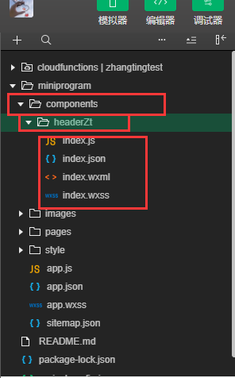

## 自定义导航栏适配多种机型

#### 在微信小程序中可以使用企业微信自带的导航栏，也可以使用自定义的导航栏。具体步骤如下:

##### （1）在app.json中设置window属性中的navigationStyle 属性为custom,即可使用自定义的导航栏.

```
{
"window": {
    "navigationStyle": "custom",
  }
}
```

##### (2)在app.js中定义全局变量，并获取设备的基本信息。

```
App({
  onLaunch: function () {
      //获取当前设备信息
    wx.getSystemInfo({
      success:res=>{
        console.log(res.statusBarHeight,'这是设备信息')
        //获取不同设备导航栏高度。保存在全局变量中
        this.globalData.headerHight = res.statusBarHeight
      },fail:err=>{
        console.log(err)
      }
    })
  },
  //设置小程序全局变量
  globalData:{
    headerHight: 0,//用于存储当前设备的导航栏高度。
  }
})

```

##### 上面获取的headerHight的值即为如下图所示的部分的高度


##### (3)封装头部组件
###### 一般来说自定义的导航栏往往会在全局的页面中都进行使用。所以这里就按照封装头部组件的方式来添加自定义导航栏。

* 在如下图所示的路径下新建如下的components组件的文件。

* 在index.json中

```
{
  "component": true,//设置是否为组件
  "usingComponents": {}//使用组件的名字以及路径
}
```

* 在index.wxml中

```
//设置高度为当前设备的导航栏的高度。
<view style='height: {{statusBarHeight}}px;'></view>
//自定义标题的内容，可根据具体需要进行丰富
<view class='title'>
<view>{{Title}}</view>
</view>
```

* 在index.wxss中自定义导航栏的样式

```
.title{
line-height: 44px;
text-align: center;
}
```

* 在index.js文件中获取全局变量

```
Component({
  /**
   * 组件的属性列表
   */
  properties: {
    Title:{
      type:String,
      value:"这是一个自定义的标题",
      observer: function (newData, oldData) {
        console.log('这个函数是为了监听该数据是否发生了变化')
      }
    }
  },

  /**
   * 组件的初始数据
   */
  data: {
    //获取全局变量中的设备导航栏高度。
    statusBarHeight: getApp().globalData.headerHight
  },

  /**
   * 组件的方法列表
   */
  methods: {

  }
})
```
##### （4）在相应页面使用组件

* 在想要使用头部的页面的.json里：

```
{
  //组件名称：路径
  "usingComponents": {
    "headerZt":"/components/headerZt/index"
  }
}
```
* 在.wxml中：
```
<view>
<headerZt Title='{{"这是标题"}}'></headerZt>
</view>

```

#### 效果图如下

